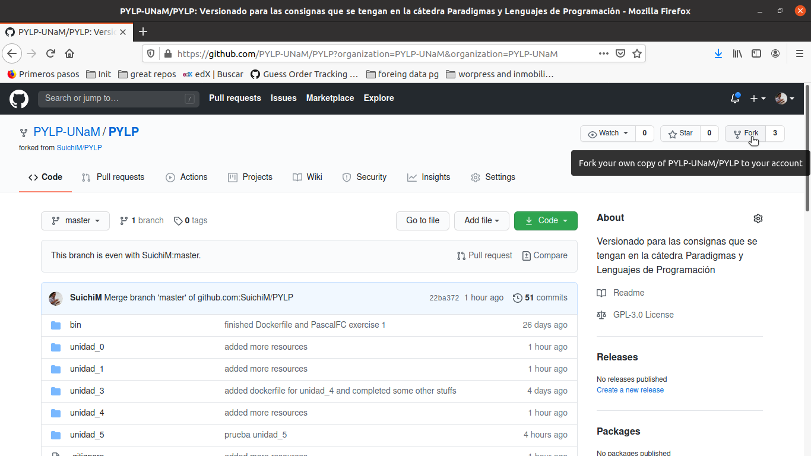
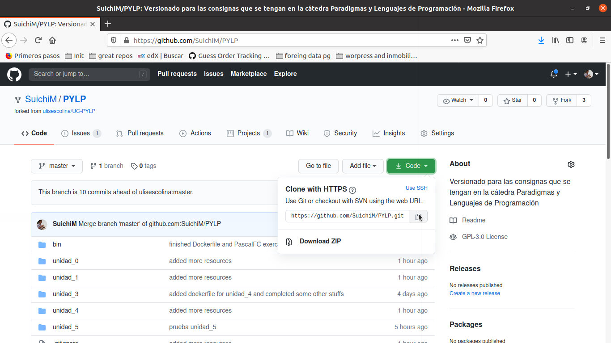

# Preparando el Entorno

## Herramientas a utilizar

- git y github
- Editor de Texto (**VS Code\***, Atom, Geany, etc)
- docker y docker-compose

_\* recomendacion de la catedra_

## 1. crearse un fork del repositorio y clonar

1. Lo primero que deberá hacer es registrarse en github. Para hacerlo puede seguir el siguiente [tutorial](https://www.youtube.com/watch?v=RKXk_nc7icg). _(si ya posee una cuenta puede omitir este paso)_

2. Lo siguiente que debe hacer es crearse un fork del repositorio, para ello ingrese a la siguiente sitio: https://github.com/PYLP-UNaM/PYLP
   haga click en el boton fork _(ver imagen)_ y siga las instrucciones.
   esto creara una copia del repositorio en su cuenta.



3. Una vez terminado el fork, ud. tendrá una copia del repositorio en su cuenta, es éste repositorio con el cuál Ud. trabajará de manera local.

4. Para clonarse el repositorio en su maquina local. debe copiarse la url del repositorio. presionando el boton Code y el boton copiar. _(ver imagen)_



5. una vez copiada la url, en una terminal debe ubicarse en la carpeta donde desea trabajar con el repositorio. y ejecutar el siguiente comando.

```sh
# ubicarse en el directorio donde se desea clonar el repositorio
# cd <path> ej:

cd /home/projects

## clonar el reposotorio
## git clone <url_copiada>
## url ~ https://github.com/suUsuario/PYLP

git clone https://github.com/SuichiM/PYLP
```
### porque usamos fork? 

aca una explicación de como se contribuye en el mundo OS 👉 [video](https://www.youtube.com/watch?v=QntLv5BjUr0&feature=youtu.be)

## 1. Instalar docker ([¿Que es docker?](https://docs.docker.com/engine/))

se recomienda utilizar una distribución de linux e [instalar usando el repositorio](https://docs.docker.com/engine/install/ubuntu/#install-using-the-repository) (facilita posteriores actualizaciones y mantenimiento).

[Instalación usando binarios](https://docs.docker.com/engine/install/) segun su plataforma

Si siguó las recomendaciones e instalo en linux y con el repositorio. revisar estos pasos de [post-instalacion.](https://docs.docker.com/engine/install/linux-postinstall/)

acá un **tutorial de como instalar docker** en linux: 👉 [tutorial](https://www.youtube.com/watch?v=JwqkjKkEIDw&feature=youtu.be)

## 2. Instalar docker-compose ([¿Qué es y porqué usar docker-compose?](https://docs.docker.com/compose/))

[Instalar compose](https://docs.docker.com/compose/install/)

## 3. Instalar VS code

[Instalar VS Code](https://code.visualstudio.com/)

### 3.1 plugins recomendados

- Docker

## 4. Correr los container de la raiz

en una terminal desde la raiz de este repo ejecutar:

```bash
# para levantar los containers
$ docker-compose up

# para parar los containers
docker-compose stop
```
